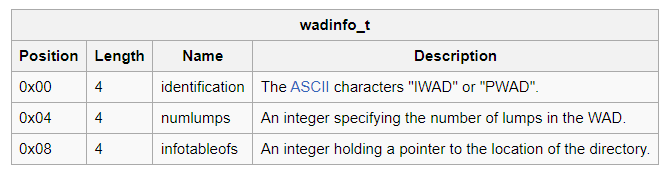
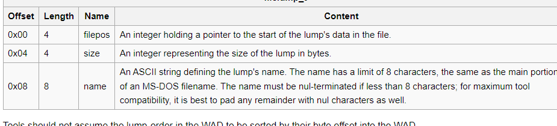

 # DOOM
 
## Contexto
 Após desenvolver um trabalho de computação gráfica, implementação de um
 sistema de simulação de câmeras sobre uma maquete 3D usando diversas formas de
 interação com o usuário, peguei gosto pela coisa. Criei o projeto em torno de
 um modelo da creepypasta Backrooms. Me empolguei com a manipulação de iluminação,
 movimentação da câmera e a possibilidade de criar um jogo de terror. Então, decidi
 dar um passo à frente no desenvolvimento de jogos recriando o jogo DOOM.

 Vou usar como referência a série de vídeos tutoriais do canal Coder Space, disponível	
 em https://www.youtube.com/watch?v=KdYTvqZmyBk&list=PLi77irUVkDasNAYQPr3N8nVcJLQAlANva&pp=iAQB.
 O projeto será desenvolvido em Python, usando a biblioteca PyGame.

## Desenvolvimento
 DOOM ficou bastante popular não apenas pelo seu gameplay, mas também pelo seu 
 incentivo ao modding. Os assets do jogo são armazenados em arquivos WAD, que
 podem ser modificados para adicionar novos níveis, novos sprites, novos sons,
 novas músicas, etc. É com base nisso que esse projeto será desenvolvido.

 Encontrei o arquivo WAD da versão 1.9 de DOOM. É com base nele que este projeto
 será desenvolvido. O arquivo WAD é um arquivo binário, então é necessário ler os 
 dados  em bytes. É a partir da manipulação de leitura desses dados, de acordo com 
 a documentação do arquivo WAD, que os diversos tipos de dados serão recuperados do
 arquivo e utilizados na construção desta aplicação. A referência para a 
 documentação do arquivo WAD pode ser encontrada em https://doomwiki.org/wiki/WAD.

### WAD Files
 Um arquivo WAD é um arquivo binário que contém todos os dados necessários para
 executar o jogo. Ele contém os mapas, os sprites, as texturas, os sons, as músicas,
 os flats, etc. Cada segmento de dados é referenciado como um *lump*. Um *lump* é um
 segmento de dados que contém um nome, um tamanho e os dados em si.

 O arquivo WAD é dividido em três partes: 
 * Header: contém informações sobre o arquivo WAD, como o tipo de arquivo, o número 
   de lumps, o offset do diretório, etc.
 * Directory: contém informações sobre os lumps, como o nome do lump, o tamanho do
   lump, o offset do lump, etc.
 * Data: contém os dados dos lumps.

#### Header
O header do arquivo WAD é composto por 12 bytes. A tabela abaixo mostra a estrutura
do header.

    
O tipo do arquivo WAD pode ser IWAD ou PWAD. De acordo com a documentação, do
doomwiki.org:
 * IWAD: An "Internal WAD" (or "Initial WAD"), or a core WAD that is loaded 
   automatically (or from a game select menu on source ports) by the engine and 
   generally provides all the data required to run the game.
 * PWAD: A "Patch WAD", or an optional file that replaces data from the IWAD 
   loaded or provides additional data to the engine.
 
O número de lumps é o número de lumps que o arquivo WAD contém. O offset do diretório
é o offset do diretório de lumps. O diretório de lumps é uma lista de lumps que
contém informações sobre cada lump. O offset do diretório é o offset do primeiro
lump no diretório de lumps.

#### Directory
De acordo com a documentação, do doomwiki.org:

*The directory associates names of lumps with the data that belong to them. It 
consists of a number of entries, each with a length of 16 bytes. The length of 
the directory is determined by the number given in the WAD header. The structure 
of each entry is as follows:*

O offset do lump é o offset do lump no arquivo WAD. O tamanho do lump é o tamanho
do lump em bytes. O nome do lump é o nome do lump. O nome do lump é composto por
8 caracteres ASCII, podendo ser preenchido com espaços em branco.

#### Data
O data é o segmento de dados do arquivo WAD. Ele contém os dados dos lumps. O offset
do data é o offset do primeiro lump no data. O tamanho do data é o tamanho do data
em bytes.

### Estrutura do projeto
No momento, o projeto está estruturado da seguinte forma:
[implemento esse trecho em outro momento]